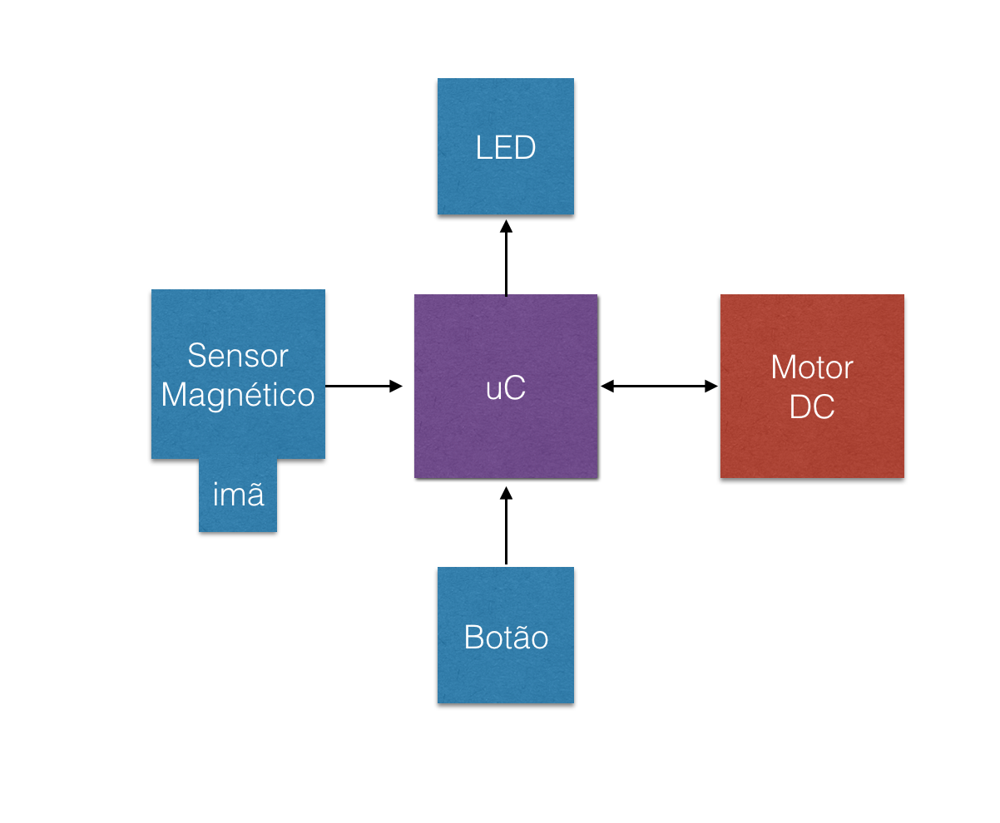

# Projeto-1-Mundo-Digital

## Descrição:
Dispensers são misturadores desenvolvidos para a indústria de cosméticos. Esses copos misturadores funcionam com uma base comum que contem um motor DC embutido que poderá ser acionado de duas formas, de acordo com a preferência do usuário. Esse motor poderá ser acionado através de um botão ou através do encaixe na base utilizando um sensor magnético.

Funcionamneto do produto:
O dispenser tem uma base misturadora que é ativada a partir de 2 entradas: um botão e um sensor magnético, e tem duas saídas, 2 LEDs e um Motor DC. Existem 4 estados possíveis que o Dispenser pode estar:

1) Botão desativado e imã desativado : Nada acontece
2) Botão ativado e imã desativado (sem copo na base) : Estado de alerta - LED vermelho piscando
3) Botão desativado e imã ativado (pronto para uso) : LED vermelho é acesso
4) Botão ativado e imã ativado (utilizando) : LED verde acesso e motor ligado. 

## Materiais Nescessários

-SAM E70

-2 LEDs (1 vermelho e 1 verde)

-BOTÃO (push button)

-SENSOR MAGNÉTICO(Reed Switch)

-IMÃ DE NEODÍMEO

-MOTOR DC

## Diagrama de Blocos Simples

## Diagrama de Blocos Completo
